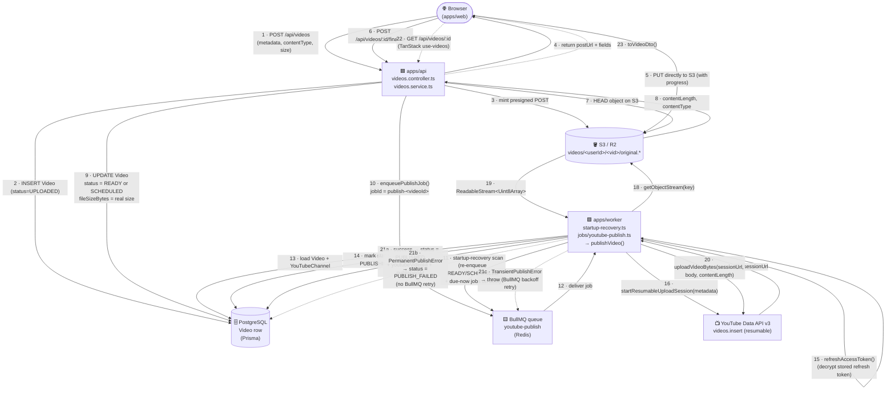

# ClipFlow

A SaaS platform for YouTube creators that automates video scheduling, thumbnail generation, and chapter-timestamp generation. A creator uploads a finished video once and ClipFlow handles the rest — extracting the transcript, generating chapters and thumbnails, and publishing to YouTube at the scheduled time.

The full product design, schema, and architecture spec live in [`docs/PRD.md`](./docs/PRD.md), [`docs/TechSpec.md`](./docs/TechSpec.md), [`docs/Schema.md`](./docs/Schema.md), [`docs/AppFlow.md`](./docs/AppFlow.md), and [`docs/Design.md`](./docs/Design.md) — read those first when working on a slice; they are the source of truth for what is in scope and out of scope.

## Repo layout

Turborepo + pnpm workspaces (`pnpm-workspace.yaml`).

- `apps/web` — Next.js 16 (App Router, RSC) + React 19 + Tailwind v4 + shadcn/ui (new-york style). Upload UI, dashboard, review screens, scheduling UI.
- `apps/api` — Express 4 + TypeScript. Auth, REST API, job enqueueing, webhook receivers (YouTube OAuth callback, Dodo Payments webhooks).
- `apps/worker` — Node.js BullMQ consumer. Calls YouTube Data API to publish scheduled videos.
- `packages/db` — Prisma schema + generated client (Prisma 7 with `@prisma/adapter-pg`).
- `packages/s3` — S3 client + presigned URL helpers (Cloudflare R2 compatible).
- `packages/youtube-upload` — Resumable upload + token-refresh logic used by the worker.
- `packages/crypto` — AES-256-GCM helpers for refresh-token storage.
- `packages/config` — Zod-validated env (`loadEnv`, `loadPublicEnv`). Imported by both apps.
- `packages/types` — Dependency-free DTOs / enum tuples shared between web and api.
- `packages/eslint-config`, `packages/typescript-config` — Shared lint/tsconfig.

## Quick start

```sh
pnpm install
pnpm dev          # turbo run dev — runs every app/package
```

Filter to a single package: `pnpm --filter <name> <script>` (e.g. `pnpm --filter web dev`).

| Script | What it does |
| --- | --- |
| `pnpm build` | `turbo run build` — dependency-ordered builds |
| `pnpm lint` | `turbo run lint` |
| `pnpm check-types` | `turbo run check-types` |
| `pnpm format` | Prettier write across `**/*.{ts,tsx,md}` |

## Video upload lifecycle

When a creator hits "Upload" in the dashboard, the request fans out across four services: the browser uploads directly to S3 (bypassing the API), the API writes a `Video` row and enqueues a publish job, Redis (BullMQ) holds the job, and the worker pulls it to drive the YouTube upload.

### High-level view

```
                                  ┌────────────────────────────────────────────────────────┐
                                  │  apps/web  (Next.js — browser)                          │
                                  │  dashboard / video-card / use-videos hook             │
                                  └────────────┬──────────────────────────┬────────────────┘
                                               │                          │
                          1 POST /api/videos   │                          │ 9  poll /api/videos/:id
                          (title, metadata,     │                          │   (TanStack Query)
                           contentType, size)   │                          │
                                               ▼                          │
                                  ┌────────────────────────────────────────────────────────┐
                                  │  apps/api  (Express)                                   │
                                  │  videos.controller.ts → videos.service.ts              │
                                  └────┬─────────────┬───────────────────┬─────────────────┘
                                       │             │                   │
                  2 create Video row  │             │  5 HEAD object     │ 6 update status
                  status=UPLOADED     │             │  on finalize       │    READY/SCHEDULED
                                       ▼             ▼                   ▼
                              ┌─────────────┐   ┌─────────────┐   ┌──────────────────────┐
                              │ PostgreSQL  │   │  S3 (R2)    │   │  BullMQ (Redis)      │
                              │ (Prisma)    │   │ videos/<u>/ │   │  queue:              │
                              │  Video row  │   │  <vid>/orig │   │   youtube-publish    │
                              └─────────────┘   └─────────────┘   └──────┬───────────────┘
                                                                        │
                                          3 presigned POST URL         │ 7 enqueue job
                                          ◄────────────────────────────┘
                                               │                          │
                  4 browser → S3 PUT          │                          │
                  (direct, with progress)     │                          │
                                               ▼                          ▼
                                       ┌─────────────┐        ┌──────────────────────────────────┐
                                       │  S3 bucket  │        │  apps/worker  (BullMQ consumer)  │
                                       │  bytes on   │        │  jobs/youtube-publish.ts         │
                                       │  disk       │        │  → publishVideo()                │
                                       └─────────────┘        └──────┬───────────────────────┘
                                                                       │
                                          8 startup-recovery scan ─────┤
                                          (re-enqueue any due jobs      │ 10 stream S3 → YouTube
                                           on worker boot/restart)      │     via resumable upload
                                                                       ▼
                                                          ┌────────────────────────────────┐
                                                          │  YouTube Data API v3            │
                                                          │  /upload/youtube/v3/videos.    │
                                                          │  insert  (resumable session)   │
                                                          └────────────┬───────────────────┘
                                                                       │
                                                                       ▼
                                                          11 status = PUBLISHED
                                                          youtubeVideoId stored
                                                          publishedAt set
```

### Sequence diagram



### State machine

```mermaid
stateDiagram-v2
    [*] --> UPLOADED : POST /api/videos (row created)
    UPLOADED --> READY       : finalizeUpload() — no scheduledPublishAt<br/>AND  enqueuePublishJob(delay=undefined)
    UPLOADED --> SCHEDULED   : finalizeUpload() — scheduledPublishAt &gt; now<br/>(no enqueue; recovery scan picks up later)
    READY     --> PUBLISHING : worker pulls job, calls publishVideo()
    SCHEDULED --> PUBLISHING : startup-recovery / delayed-job trigger
    PUBLISHING --> PUBLISHED : YouTube videos.insert returned youtubeVideoId
    PUBLISHING --> PUBLISH_FAILED : PermanentPublishError<br/>(invalid_grant / channel not connected / 4xx)
    PUBLISHING --> PUBLISHING : TransientPublishError<br/>(BullMQ exponential backoff, N attempts)
    PUBLISH_FAILED --> PUBLISHING : manual re-enqueue (future)
    PUBLISHED --> [*]
```



### Who owns each phase

| Phase | Owner | What runs | State written |
|---|---|---|---|
| **1. Create row** | `apps/api` (`videos.service.createVideo`) | Verifies `YouTubeChannel.status = CONNECTED`; mints `vid_<uuid>`; computes `s3KeyOriginal = videos/<userId>/<vid>/original.<ext>`; creates row at `status = UPLOADED` | DB |
| **2. Presign** | `apps/api` (`@clipflow/s3 → createPresignedPostUrl`) | AWS SigV4 POST policy tied to the exact key + `content-length-range` ≤ `YOUTUBE_MAX_VIDEO_BYTES` and TTL `YOUTUBE_PRESIGNED_POST_TTL` | nothing yet |
| **3. Browser upload** | `apps/web` | Direct browser → S3 (bypasses the Node API to avoid loading GB through the process) | S3 object |
| **4. Finalize** | `apps/api` (`videos.service.finalizeUpload`) | HEADs S3 → confirms size + content-type; rejects oversize with 413 + best-effort delete; transitions to `READY` (immediate) or `SCHEDULED` (future); enqueues `youtube-publish` with deterministic `jobId = publish-<videoId>` so retries dedupe | DB + BullMQ |
| **5. Schedule or recover** | `apps/worker` (`startup-recovery.ts`) on boot **or** BullMQ delayed delivery | Re-enqueues `READY` / `SCHEDULED` rows where `scheduledPublishAt` is null or in the past — covers worker crashes, Redis flushes, and `SCHEDULED` videos whose clock has ticked over | BullMQ |
| **6. Publish** | `apps/worker` (`jobs/youtube-publish.ts` → `publishVideo()` in `@clipflow/youtube-upload`) | Marks `PUBLISHING`; refreshes OAuth access token; opens resumable upload session against YouTube; streams the S3 object body straight into YouTube via `fetch(sessionUrl, { body: Web ReadableStream })` | DB |
| **7. Terminal** | same | On 2xx from YouTube → `PUBLISHED` + `youtubeVideoId` + `publishedAt`. On `PermanentPublishError` → `PUBLISH_FAILED` + `failureReason`, no retry. On `TransientPublishError` → rethrow, BullMQ backoff retry | DB |

### Failure paths (explicitly designed)

- **Oversize file at finalize** → API deletes the S3 object best-effort, returns `413 FILE_TOO_LARGE` so the user can re-upload under the cap.
- **`YouTubeChannel.status = NEEDS_REAUTH`** during finalize → already blocked at row-create (`412 YOUTUBE_NOT_CONNECTED`); during publish → marked `PUBLISH_FAILED` with `failureReason = "Channel needs reauth: …"` and surfaces the reconnection banner from `docs/AppFlow.md §6`.
- **Worker dies mid-publish** → row stays in `PUBLISHING`; next boot the recovery scan doesn't touch it (not in `READY`/`SCHEDULED`), but BullMQ's stalled-job detection re-delivers. Recovery only acts on jobs that never made it into the queue.
- **Unknown error** → job treats as transient (rethrow) rather than silently losing it.

### Things deliberately not in the pipeline yet

The PRD/TechSpec describe an FFmpeg → AssemblyAI → LLM → Imagen pipeline with parallel `chapters` + `thumbnails` jobs feeding a `ready_for_review` state. That work isn't built — the v1 queue only has `youtube-publish`, and `Video.status` jumps straight from `UPLOADED` → `READY`/`SCHEDULED` → `PUBLISHING` → `PUBLISHED`. When those jobs land, the same `BullMQ queue.add` pattern in `apps/api/src/lib/queue.ts` extends cleanly: add new queues, have `finalizeUpload` enqueue into `video-ingest` first, and let it fan out the way `docs/AppFlow.md §3` shows.

## Environment

`@clipflow/config` (`packages/config/src/index.ts`) is the single source of truth for env vars. Validation runs at boot and **fails fast** with a field-level error dump. Required: `DATABASE_URL`, `JWT_SECRET` (≥32 chars), `ENCRYPTION_KEY` (≥32 chars). Optional: `REDIS_URL`, `GOOGLE_CLIENT_ID/SECRET/REDIRECT_URI`, `RATE_LIMIT_WINDOW_MS`, `RATE_LIMIT_MAX`, `S3_*`, `YOUTUBE_MAX_VIDEO_BYTES`, `YOUTUBE_PRESIGNED_POST_TTL`, `BULLMQ_PREFIX`. `apps/web` only consumes `NEXT_PUBLIC_API_BASE_URL` via `loadPublicEnv()`.

See `apps/api/.env.example` and `apps/worker/.env.example` for the local-dev shape.

## Conventions

- **Env validation is the source of truth.** Add new vars to `packages/config/src/index.ts`, not inline in app code.
- **Throw `AppError(statusCode, code, message)`, never raw `Error`.** The central middleware maps to `ApiErrorBody`.
- **Validate at the edge with zod.** Schemas in `modules/<feature>/<feature>.schemas.ts`, attached via `validate({ body: schema })`.
- **Cache invalidation on writes.** Both auth and onboarding controllers call `cache.del(\`me:${userId}\`)` after register/login/profile updates; follow the pattern for any new write that affects `/api/auth/me`.
- **DTO mapping.** Services map Prisma rows → DTOs via small helpers; never leak Prisma types past the service layer.
- **Idempotent webhooks** are a hard requirement (see `docs/TechSpec.md` Section 6).
- **Cost guards in API, not UI.** Tier limits (videos/month, thumbnails/video) are enforced server-side before enqueueing — UI hints are advisory only.
- **One channel per user (v1).** `User` has a 1:1 `YouTubeChannel` in the spec'd schema; don't model 1:N until v2.

## Useful links

- [Tasks](https://turborepo.dev/docs/crafting-your-repository/running-tasks)
- [Caching](https://turborepo.dev/docs/crafting-your-repository/caching)
- [Remote Caching](https://turborepo.dev/docs/core-concepts/remote-caching)
- [CLI Usage](https://turborepo.dev/docs/reference/command-line-reference)