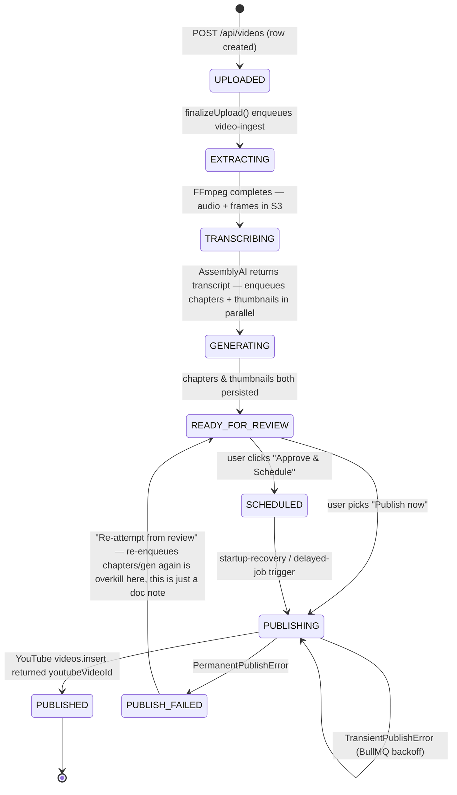

# ClipFlow

A SaaS platform for YouTube creators that automates video scheduling, thumbnail generation, and chapter-timestamp generation. A creator uploads a finished video once, and ClipFlow handles the rest — extracting audio, generating chapter and thumbnail candidates, and publishing to YouTube at the scheduled time.

The full product design, schema, and architecture spec live in [`docs/PRD.md`](./docs/PRD.md), [`docs/TechSpec.md`](./docs/TechSpec.md), [`docs/Schema.md`](./docs/Schema.md), [`docs/AppFlow.md`](./docs/AppFlow.md), and [`docs/Design.md`](./docs/Design.md) — read those first when working on a slice; they are the source of truth for what is in scope and out of scope.

## Pipeline status

End-to-end target pipeline:

```
upload (browser → S3)
  → finalize (Video row, status = UPLOADED)
  → ingest (FFmpeg in worker: audio + frames; status = EXTRACTING)
  → transcription (AssemblyAI; status = TRANSCRIBING)
  → chapters + thumbnails in parallel
    (LLM over transcript, Imagen over extracted frames; status = GENERATING)
  → ready_for_review (status = READY_FOR_REVIEW)
  → approval → SCHEDULED → PUBLISHING → PUBLISHED
```

Slices shipped to date:

| Slice | Status | Notes |
|---|---|---|
| Auth (NextAuth edge layer + Express JWT) | ✅ shipped | Email/password, refresh-token rotation, session cookies via NextAuth; backend issues its own access + refresh JWTs |
| Onboarding wizard | ✅ shipped | 4-step profile (display name → niche → frequency → goal); recommended plan computed server-side |
| Dashboard + settings shell | ✅ shipped | Sidebar layout, settings sub-routes (profile / preferences / generation / scheduling / notifications / appearance / security) |
| YouTube OAuth connect/disconnect | ✅ shipped | Encrypted refresh-token storage, `NEEDS_REAUTH` detection, re-connect banner |
| **Upload + finalize** | ✅ shipped | Browser → S3 via presigned POST; API creates row and enqueues |
| **Ingest queue (audio + frames)** | ✅ shipped | FFmpeg run in worker; SSE progress events; status lands at `TRANSCRIBING` |
| **Publish queue (YouTube upload)** | ✅ shipped | Resumable upload, token refresh, startup-recovery scan |
| SSE progress streaming | ✅ shipped | API publishes events, worker consumes, web subscribes via `useVideoSse` |
| Custom thumbnail upload | ✅ shipped | Optional JPEG/PNG ≤ 2 MB; threaded into both S3 presign and YouTube `thumbnails.set` |
| **Transcription → chapters + thumbnails → review** | 🚧 **next slice** | See [Next slice: AI processing pipeline](#next-slice-ai-processing-pipeline) below |
| Billing / Dodo Payments | ⏳ planned | Subscription webhooks → usage limits |
| Performance analytics (v1.5) | ⏳ planned | Analytics-sync worker → cached `VideoStats` table |

## Repo layout

Turborepo + pnpm workspaces (`pnpm-workspace.yaml`).

- `apps/web` — Next.js 16 (App Router, RSC) + React 19 + Tailwind v4 + shadcn/ui (new-york style). Marketing landing, auth flow, onboarding wizard, dashboard, settings, review UI.
  - **Edge middleware** uses NextAuth (Auth.js v5) to gate `/dashboard` and `/onboarding`. The Express API's JWT sits inside NextAuth's session cookie; NextAuth refreshes the access token transparently in its `jwt` callback.
- `apps/api` — Express 4 + TypeScript. Owns its own JWT auth (access + refresh, with rotation), endpoints for users, onboarding, preferences, settings, videos, YouTube OAuth, and (coming soon) transcription/generation.
- `apps/worker` — Node.js + BullMQ consumer. Two jobs in production today: `video-ingest` (audio/frame extraction via FFmpeg) and `youtube-publish` (resumable upload via YouTube Data API v3). The next slice adds `transcription`, `chapters`, and `thumbnails`.
- `packages/db` — Prisma schema + generated client (Prisma 7 with `@prisma/adapter-pg`).
- `packages/s3` — S3 client + presigned URL helpers (Cloudflare R2 compatible).
- `packages/youtube-upload` — Resumable upload + token-refresh logic used by the worker.
- `packages/crypto` — AES-256-GCM helpers for refresh-token + YouTube-token encryption.
- `packages/config` — Zod-validated env (`loadEnv`, `loadPublicEnv`). Imported by all three apps.
- `packages/types` — Dependency-free DTOs / enum tuples shared between web and api.
- `packages/eslint-config`, `packages/typescript-config` — Shared lint/tsconfig.

## Quick start

```sh
pnpm install
pnpm dev          # turbo run dev — runs every app/package
```

Filter to a single package: `pnpm --filter <name> <script>` (e.g. `pnpm --filter web dev`).

| Script | What it does |
| --- | --- |
| `pnpm build` | `turbo run build` — dependency-ordered builds |
| `pnpm lint` | `turbo run lint` |
| `pnpm check-types` | `turbo run check-types` |
| `pnpm format` | Prettier write across `**/*.{ts,tsx,md}` |

## Video upload lifecycle

The end-to-end pipeline the system is designed to run. Today, the first four stages (upload, finalize, ingest, publish) are shipping; **the middle stages — transcription through ready-for-review — are the next slice** (see the next section). The diagram below shows the target end state; the reader-friendly summary of "what is built vs coming" is the [Pipeline status](#pipeline-status) table above.

### Target end-state pipeline

```
                          ┌────────────────────────────────────────────────────────┐
                          │  apps/web  (Next.js — browser)                          │
                          │  dashboard / video-card / use-videos + use-video-sse  │
                          └────────────┬──────────────────────────┬────────────────┘
                                       │                          │
        1 POST /api/videos             │                          │ 11 subscribe SSE
        (title, metadata,             │                          │   (useVideoSse)
         optional thumbnail,          │                          │   + poll /api/videos/:id
         contentType, size)           │                          │
                                       ▼                          │
                          ┌────────────────────────────────────────────────────────┐
                          │  apps/api  (Express)                                   │
                          │  videos.controller.ts → videos.service.ts              │
                          └────┬─────────────┬───────────────────┬─────────────────┘
                               │             │                   │
              2 create row    │             │  5 HEAD object     │ 6 enqueue
              status=UPLOADED │             │  on finalize       │   video-ingest
                               ▼             ▼                   ▼
                          ┌─────────────┐ ┌─────────────┐ ┌──────────────────────────┐
                          │ PostgreSQL  │ │  S3 (R2)    │ │  BullMQ (Redis)          │
                          │ (Prisma)    │ │ videos/<u>/ │ │  queues: video-ingest,   │
                          │  Video row  │ │  <vid>/orig │ │   transcription,         │
                          │             │ │  audio.mp3  │ │   chapters, thumbnails,  │
                          │             │ │  frames/... │ │   youtube-publish        │
                          └─────────────┘ └─────────────┘ └──────┬──────────────────┘
                                                                   │
                                              3 presigned POST    │  7 worker pulls job
                                              ◄───────────────────┘
                                                   │
                  4 browser → S3 PUT                │
                  (direct, with progress)           │
                                                   ▼
                                       ┌──────────────────────────────────────────┐
                                       │  apps/worker  (BullMQ consumer)           │
                                       │  jobs/video-ingest.ts (FFmpeg)            │
                                       │  jobs/transcription.ts (AssemblyAI) ← next│
                                       │  jobs/chapters.ts (LLM)             ← next│
                                       │  jobs/thumbnails.ts (Imagen+sharp)  ← next│
                                       │  jobs/youtube-publish.ts (publishVideo)   │
                                       │  startup-recovery.ts                     │
                                       └──────┬───────────────────────┬────────────┘
                                              │                       │
                          8a ingest ──────────►│                       │
                              (audio + frames) │                       │  10 publish
                                              │                       │   (resumable upload)
                                              ▼                       ▼
                                  ┌──────────────────────┐   ┌────────────────────────┐
                                  │  YouTube Data API v3 │   │  S3 stream → YouTube   │
                                  │  (publish path only) │   │  fetch(sessionUrl, {}) │
                                  └──────────────────────┘   └────────────────────────┘
```

### Sequence diagram (target end state)

```mermaid
flowchart TD
    %% ─────────────── ACTORS ───────────────
    Browser(["🌐 Browser<br/>(apps/web)"])
    API["🟦 apps/api<br/>videos.controller.ts<br/>videos.service.ts"]
    DB[("🗄️ PostgreSQL<br/>Video row<br/>(Prisma)")]
    S3[("🪣 S3 / R2<br/>videos/&lt;userId&gt;/&lt;vid&gt;/...")]
    QIngest["🟨 BullMQ<br/>video-ingest"]
    QTx["🟨 BullMQ<br/>transcription"]
    QGen["🟨 BullMQ<br/>chapters + thumbnails"]
    QPub["🟨 BullMQ<br/>youtube-publish"]
    Worker["🟩 apps/worker"]
    YT["📺 YouTube Data API v3<br/>videos.insert (resumable)"]
    AAI["🗣️ AssemblyAI<br/>(next slice)"]
    LLM["🧠 LLM (next slice)"]
    IMG["🖼️ Imagen (next slice)"]

    %% ─────────────── UPLOAD PHASE (shipped) ───────────────
    Browser -- "1 · POST /api/videos" --> API
    API -- "2 · INSERT Video (status=UPLOADED)" --> DB
    API -- "3 · mint presigned POST + optional thumbnail POST" --> S3
    API -- "4 · return postUrl + fields" --> Browser
    Browser -- "5 · PUT directly to S3 (with progress)" --> S3

    %% ─────────────── FINALIZE + ENQUEUE INGEST (shipped) ───────────────
    Browser -- "6 · POST /api/videos/:id/finalize" --> API
    API -- "7 · HEAD object on S3" --> S3
    API -- "8 · UPDATE Video<br/>status = EXTRACTING<br/>fileSizeBytes = real size" --> DB
    API -- "9 · enqueueIngestJob()<br/>jobId = ingest-&lt;videoId&gt;" --> QIngest

    %% ─────────────── INGEST (shipped) ───────────────
    Worker -- "10 · pull ingest job" --> QIngest
    Worker -- "11 · download original → FFmpeg<br/>audio + candidate frames" --> S3
    Worker -- "12 · upload audio + frames to S3" --> S3
    Worker -- "13 · UPDATE Video<br/>status = TRANSCRIBING<br/>+ s3KeyAudio / s3KeyFramesPrefix" --> DB
    Worker -. "13b · publish SSE PROGRESS + STATUS_UPDATE" .-> Browser

    %% ─────────────── TRANSCRIPTION (next slice) ───────────────
    Worker -- "14 · enqueue transcription job" --> QTx
    Worker -- "15 · pull transcription job" --> QTx
    Worker -- "16 · stream audio → AssemblyAI" --> AAI
    Worker -- "17 · write Transcript row<br/>(fullText + wordTimestamps)" --> DB
    Worker -- "18 · enqueue chapters + thumbnails in parallel" --> QGen
    Worker -- "19 · UPDATE Video status = GENERATING" --> DB

    %% ─────────────── CHAPTERS + THUMBNAILS (next slice) ───────────────
    Worker -- "20 · chapters job: LLM over transcript" --> LLM
    Worker -- "21 · thumbnails job: Imagen + sharp composite" --> IMG
    Worker -- "22 · write Chapter rows (validated against YT rules)" --> DB
    Worker -- "23 · write Thumbnail rows + upload to S3" --> DB
    Worker -- "24 · UPDATE Video status = READY_FOR_REVIEW" --> DB

    %% ─────────────── REVIEW + APPROVAL (next slice) ───────────────
    Browser -- "25 · open Video Detail · GET /api/videos/:id<br/>(chapters + thumbnails)" --> API
    Browser -- "26 · edit chapters, pick thumbnail,<br/>PATCH /api/videos/:id" --> API
    API -- "27 · UPDATE Video.selectedThumbnailId<br/>+ replace Chapter rows" --> DB
    Browser -- "28 · Approve & Schedule<br/>PATCH scheduledPublishAt" --> API
    API -- "29 · UPDATE Video status = SCHEDULED" --> DB
    API -- "30 · enqueuePublishJob(jobId = publish-&lt;videoId&gt;<br/>delay = until scheduledPublishAt)" --> QPub

    %% ─────────────── PUBLISH (shipped) ───────────────
    Worker -- "31 · startup-recovery scan<br/>+ pull delayed job" --> QPub
    Worker -- "32 · load Video + YouTubeChannel<br/>mark PUBLISHING" --> DB
    Worker -- "33 · startResumableUploadSession(metadata)" --> YT
    Worker -- "34 · getObjectStream(key)" --> S3
    Worker -- "35 · uploadVideoBytes(sessionUrl, body, contentLength)" --> YT

    %% ─────────────── TERMINAL STATES (shipped) ───────────────
    Worker -- "36a · success → status = PUBLISHED<br/>+ youtubeVideoId + publishedAt" --> DB
    Worker -. "36b · PermanentPublishError<br/>→ status = PUBLISH_FAILED" .-> DB
    Worker -. "36c · TransientPublishError<br/>→ BullMQ backoff retry" .-> QPub
```



### State machine (target end state)



### What's in `apps/worker` today

`apps/worker/src/jobs/`:

| Job | Queue | Shipped? | What it does |
|---|---|---|---|
| `video-ingest.ts` | `video-ingest` | ✅ | Reads original bytes from S3 → temp file → single FFmpeg invocation extracts MP3 audio + candidate JPEG frames → uploads both back to S3 → flips status to `TRANSCRIBING`. Publishes SSE PROGRESS / STATUS_UPDATE for live UI. |
| `youtube-publish.ts` | `youtube-publish` | ✅ | Runs `packages/youtube-upload` → YouTube `videos.insert` resumable session. Refreshes access token from the encrypted refresh-token. Marks `PUBLISHED` on 2xx, `PUBLISH_FAILED` on permanent errors, rethrows transient errors for BullMQ backoff. |
| `transcription.ts` | `transcription` | 🚧 next | (See below.) |
| `chapters.ts` | `chapters` | 🚧 next | (See below.) |
| `thumbnails.ts` | `thumbnails` | 🚧 next | (See below.) |

Startup recovery (`apps/worker/src/startup-recovery.ts`) reconciles `PUBLISHING` orphans (finalize if `youtubeVideoId` set, else reset to `READY`) BEFORE re-enqueueing `READY`/`SCHEDULED` rows. The `TRANSCRIBING` / `GENERATING` rows are owned by the [next slice](#next-slice-ai-processing-pipeline), so today's recovery pass intentionally leaves them alone.

### Who owns each shipped phase

| Phase | Owner | What runs | State written |
|---|---|---|---|
| **1. Create row** | `apps/api` (`videos.service.createVideo`) | Verifies `YouTubeChannel.status = CONNECTED`; mints `vid_<uuid>`; computes `s3KeyOriginal = videos/<userId>/<vid>/original.<ext>`; creates row at `status = UPLOADED` (and `EXTRACTING` once `enqueueIngestJob` confirms) | DB |
| **2. Presign** | `apps/api` (`@clipflow/s3 → createPresignedPostUrl`) | AWS SigV4 POST policy tied to the exact key + `content-length-range` ≤ `YOUTUBE_MAX_VIDEO_BYTES`; mints a parallel presigned POST for `s3KeyThumbnail` when the user picked a custom JPEG/PNG | nothing yet |
| **3. Browser upload** | `apps/web` | Direct browser → S3 (bypasses the Node API to avoid loading GB through the process); thumbnail uploaded in parallel if present | S3 objects |
| **4. Finalize** | `apps/api` (`videos.service.finalizeUpload`) | HEADs S3 → confirms size + content-type; rejects oversize with 413 + best-effort delete; flips status `UPLOADED → EXTRACTING`; enqueues `video-ingest` with deterministic `jobId = ingest-<videoId>` | DB + BullMQ |
| **5. Ingest** | `apps/worker` (`jobs/video-ingest.ts`) | FFmpeg single invocation; uploads `videos/<vid>/audio.mp3` + `videos/<vid>/frames/frame_*.jpg`; persists `s3KeyAudio`, `s3KeyFramesPrefix`, `frameCount`, `durationSeconds`; status → `TRANSCRIBING` | DB + S3 + SSE |
| **6. Schedule or recover** | `apps/worker` (`startup-recovery.ts`) on boot **or** BullMQ delayed delivery | Re-enqueues `READY` / `SCHEDULED` rows where `scheduledPublishAt` is null or in the past — covers worker crashes, Redis flushes, and `SCHEDULED` videos whose clock has ticked over | BullMQ |
| **7. Publish** | `apps/worker` (`jobs/youtube-publish.ts` → `publishVideo()` in `@clipflow/youtube-upload`) | Marks `PUBLISHING`; refreshes OAuth access token; opens resumable upload session against YouTube; streams the S3 object body straight into YouTube via `fetch(sessionUrl, { body: Web ReadableStream })` | DB |
| **8. Terminal** | same | On 2xx from YouTube → `PUBLISHED` + `youtubeVideoId` + `publishedAt`. On `PermanentPublishError` → `PUBLISH_FAILED` + `failureReason`, no retry. On `TransientPublishError` → rethrow, BullMQ backoff retry | DB |

### Failure paths (explicitly designed)

- **Oversize file at finalize** → API deletes the S3 object best-effort, returns `413 FILE_TOO_LARGE`.
- **`YouTubeChannel.status = NEEDS_REAUTH`** during finalize → already blocked at row-create (`412 YOUTUBE_NOT_CONNECTED`); during publish → marked `PUBLISH_FAILED` with `failureReason = "Channel needs reauth: …"` and surfaces the reconnection banner from `docs/AppFlow.md §6`.
- **Worker dies mid-publish** → row stays in `PUBLISHING`; the startup-recovery scan on the next boot reconciles it (finalize if `youtubeVideoId` set, else reset to `READY`).
- **Worker dies mid-ingest** → row stays in `EXTRACTING`; the job is re-enqueued by the recovery scan, idempotent via `jobId = ingest-<videoId>` + the `s3KeyAudio` presence guard inside the job.
- **Unknown error** → job treats as transient (rethrow) rather than silently losing it.

## Next slice: AI processing pipeline

The video-ingest job today leaves rows at `TRANSCRIBING` with no consumer. The next slice wires the rest of the AI pipeline end-to-end, from `TRANSCRIBING` through to `READY_FOR_REVIEW` (the point at which the user is asked to review and approve).

### Why this is the next slice

The PRD's core user story is:

> _As a creator, I see a transcript-derived set of chapter markers I can edit before they're applied._
> _As a creator, I see 3-10 AI-generated thumbnail options (tier-dependent) and pick one, or regenerate._
> _As a creator, I set a publish date/time and the video goes live on YouTube automatically at that time, with my chosen thumbnail and chapters already applied._

Today the user can upload and ClipFlow can publish — but with no chapters, no thumbnail options, and the publish button as a hand-cranked "Publish now" instead of a scheduled drop. The AI pipeline is what turns ClipFlow from "another upload tool" into "upload once, walk away."

### What the slice adds

```
TRANSCRIBING (current end-of-pipeline)
   │
   ▼   ← new
transcription (AssemblyAI)
   │      — pulls the audio file from S3, requests word-level timestamps,
   │      writes a Transcript row (fullText + wordTimestamps).
   │      On success → status = GENERATING, enqueues chapters + thumbnails
   │      in parallel. On transient failure → rethrow (BullMQ backoff).
   │      On permanent failure (audio missing, unsupported codec, budget
   │      exhausted) → status = FAILED, no retry, SSE ERROR event.
   ▼   ← new
chapters       thumbnails       (two jobs enqueued by transcription)
   │              │
   │              │ — Imagen → sharp composite on top of FFmpeg-extracted
   │              │   base frame → 1280x720 JPEG, tier-limited count
   │              │   (3/5/10 per plan), uploaded to S3 under
   │              │   `videos/<vid>/thumbnails/thumb_<idx>.jpg`
   │              │
   │ — LLM over transcript, structured JSON output,
   │   server-side validated against YouTube's rules:
   │   first = 0, ≥3 chapters, ≥10 s apart
   │
   └──────┬───────┘
          ▼   ← new
   status = READY_FOR_REVIEW
   │
   ▼   ← new
   Review screen (apps/web): chapters editable inline (drag-reorder,
   add/remove), thumbnail grid with "Regenerate" (counts against the
   tier cap). Validation errors appear inline against the offending
   chapter row. User clicks "Approve & Schedule" → status flips to
   SCHEDULED / transitions to publish.
```

### What changes where

| Layer | File(s) | Change |
|---|---|---|
| DB | `packages/db/schema.prisma` | `Transcript` and `Chapter` tables already exist; `Thumbnail` is implied by `Video.selectedThumbnailId`. A thin migration may add a `generationIndex` field on `Thumbnail` for the per-tier counter UI; cheap and additive. |
| DB enums | same | `VideoStatus` already has `EXTRACTING / TRANSCRIBING / GENERATING / READY_FOR_REVIEW` declared — no enum change needed. |
| Types | `packages/types/src/index.ts` | New DTOs for the transcript chunk of `/api/videos/:id`; new `ListChapter` / `SelectThumbnail` shapes for the review PATCH. |
| API | `apps/api/src/modules/videos/` | New service methods: `getTranscript(videoId)`, `updateChapters(videoId, chapters[])`, `selectThumbnail(videoId, thumbnailId)`, `regenerateThumbnails(videoId)` (the last two gated by tier counts). Schema additions: a `chapters` array on the VideoDetail DTO, a `thumbnails[]` array. |
| Worker | `apps/worker/src/jobs/{transcription,chapters,thumbnails}.ts` | Three new BullMQ jobs mirroring `video-ingest.ts` (idempotency guards, transient/permanent classification, SSE events). `video-ingest.ts` flips to enqueueing `transcription` at the end instead of stopping at `TRANSCRIBING`. |
| Worker | `apps/worker/src/startup-recovery.ts` | Extend the recovery scan to also re-enqueue `TRANSCRIBING` / `GENERATING` rows the same way it currently handles `READY` / `SCHEDULED`. |
| Web | `apps/web/app/dashboard/{published,published/[id]}/` | The existing video-detail page gets a `READY_FOR_REVIEW` rendering path: chapters list + thumbnail grid + "Approve & Schedule" + "Regenerate" + per-tier remaining counter. |
| Web | `apps/web/hooks/use-videos.ts` + `components/dashboard/review/` | New hooks + a review panel. Most of the existing infrastructure (TanStack Query, `useApi`, SSE progress, query-keys) extends cleanly. |
| Config | `packages/config/src/index.ts` | New env vars: `ASSEMBLYAI_API_KEY`, `OPENAI_API_KEY` (or `ANTHROPIC_API_KEY` — TBD), `GOOGLE_IMAGEN_*`, plus per-tier cap constants. |
| Billing gate | `apps/api/src/modules/videos/videos.service.ts` | Where the per-tier cap on regenerations lives — `videosPerMonth` already exists on `Subscription` from the earlier PRD design; the slice just reads it server-side before accepting a regeneration POST. |

### Constraints the slice has to honor

- **Chapters must validate against YouTube's rules before storage** (first = 0, min 3, min 10 s apart). The LLM is asked politely and its output is enforced deterministically — bad chapters never reach `READY_FOR_REVIEW`.
- **Thumbs are tier-limited**: count is a property of the plan, not the video. A request that exceeds the cap returns 402 / 409 — UI is advisory, server is authoritative.
- **Transcripts are kept intact** even after chapter generation — `v2`'s Shorts/Reels work needs the same transcript (word timestamps → highlight detection).
- **Parallelism**: chapters and thumbnails are independent once the transcript exists — the `transcription` job's terminal step enqueues both into different queues and the worker pool drains them concurrently. Both must complete before `READY_FOR_REVIEW`.
- **One sub-task failing does not block the other**: chapters failing does not strand thumbnails, and vice versa. The video moves to `READY_FOR_REVIEW` with the partial set and the review screen shows the missing piece ("chapters unavailable, you can add manually").
- **Idempotency**: each worker job has a deterministic `jobId = <verb>-<videoId>` so retries dedupe in BullMQ. Service-layer guards (`s3KeyAudio` for ingest) protect against accidental double-runs.

### Out of scope for this slice

- **Scheduling UX** beyond reusing the existing publish-time picker (the PRD's full schedule picker lands with billing or separately as a smaller slice).
- **Performance analytics** (views/CTR/watch-time) — v1.5; the OAuth scope is already requested today so this drops in later without re-consent.
- **Multi-channel** (v2; explicit constraint).
- **Reels / Shorts generation** (v2).

### Reference

- [`docs/AppFlow.md` §3](./docs/AppFlow.md) — "Processing flow" — visual diagram of the same pipeline plus the failure-handling stance ("don't block the rest of the pipeline if one sub-task fails").
- [`docs/Schema.md` §2](./docs/Schema.md) — `Transcript`, `Chapter`, `Thumbnail` table shapes (already spec'd; no v2 additions needed).
- [`docs/TechSpec.md` §4](./docs/TechSpec.md) — External integration notes for AssemblyAI, the LLM prompt, and Imagen + sharp compositing.
- [`docs/Design.md` §3](./docs/Design.md) — "Review screen" — the one screen allowed a "page-load sequence" reveal moment; thumbnail grid + chapters list rules.

## Environment

`@clipflow/config` (`packages/config/src/index.ts`) is the single source of truth for env vars. Validation runs at boot and **fails fast** with a field-level error dump. Required today: `DATABASE_URL`, `AUTH_SECRET` (≥32 chars), `ENCRYPTION_KEY` (≥32 chars). Optional today: `REDIS_URL`, `GOOGLE_CLIENT_ID/SECRET/REDIRECT_URI`, `RATE_LIMIT_WINDOW_MS`, `RATE_LIMIT_MAX`, `S3_*`, `YOUTUBE_MAX_VIDEO_BYTES`, `YOUTUBE_PRESIGNED_POST_TTL`, `BULLMQ_PREFIX`, `FFMPEG_PATH`. `apps/web` only consumes `NEXT_PUBLIC_API_BASE_URL` via `loadPublicEnv()`. The next slice adds `ASSEMBLYAI_API_KEY`, an LLM key (OpenAI or Anthropic — TBD), and Imagen creds.

See `apps/api/.env.example`, `apps/worker/.env.example`, and `apps/api/.env.docker` for the local-dev shape.

## Conventions

- **Env validation is the source of truth.** Add new vars to `packages/config/src/index.ts`, not inline in app code.
- **Throw `AppError(statusCode, code, message)`, never raw `Error`.** The central middleware maps to `ApiErrorBody`.
- **Validate at the edge with zod.** Schemas in `modules/<feature>/<feature>.schemas.ts`, attached via `validate({ body: schema })`.
- **Cache invalidation on writes.** Auth, onboarding, preferences, and videos controllers all call `cache.del(\`<scope>:${userId}\`)` on writes that affect downstream reads; follow the pattern for any new write that affects a cached scope.
- **DTO mapping.** Services map Prisma rows → DTOs via small helpers; never leak Prisma types past the service layer.
- **Idempotent webhooks** are a hard requirement (see `docs/TechSpec.md` Section 6).
- **Cost guards in API, not UI.** Tier limits (videos/month, regenerations/month, thumbnails/video) are enforced server-side before enqueueing — UI hints are advisory only.
- **One channel per user (v1).** `User` has a 1:1 `YouTubeChannel` in the spec'd schema; don't model 1:N until v2.

## Useful links

- [Tasks](https://turborepo.dev/docs/crafting-your-repository/running-tasks)
- [Caching](https://turborepo.dev/docs/core-concepts/caching)
- [Remote Caching](https://turborepo.dev/docs/core-concepts/remote-caching)
- [CLI Usage](https://turborepo.dev/docs/reference/command-line-usage)
